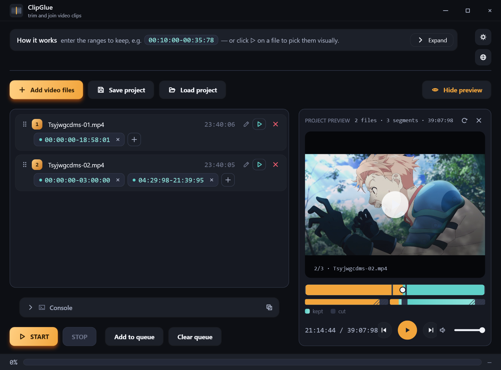
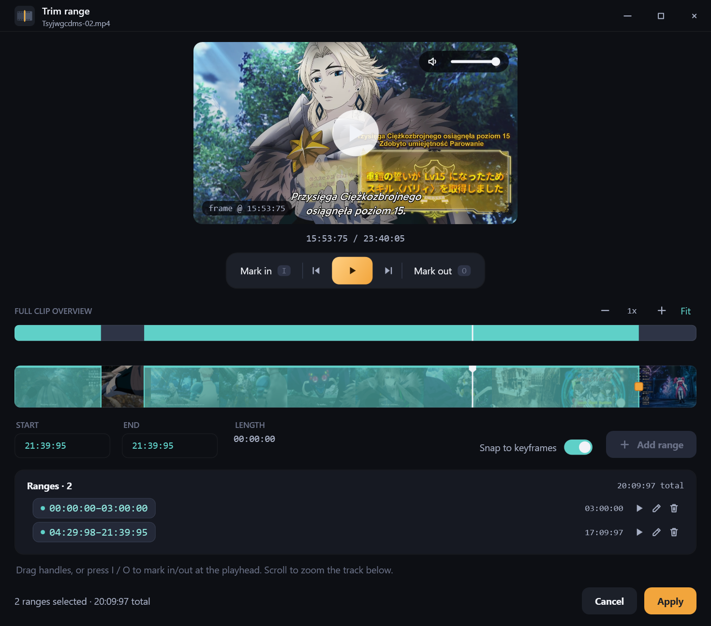

# ClipGlue

A simple, fast tool for trimming and joining video clips — without
re-encoding the whole file whenever it can be avoided. Pick your files,
give the time ranges you want to keep (or select them visually on a
timeline), and ClipGlue cuts and concatenates them with a single ffmpeg
pass.

WPF / .NET 8, Windows.

## Features

- File list with keep-ranges per file (drag to reorder, multiple ranges
  per file).
- **Trim range** window — real video playback, a full-file minimap, a
  zoomable timeline with frame thumbnails, keyframe snapping, mouse or
  keyboard in/out marking.
- **Whole-project preview** in the main window — plays back the stitched
  result live, without encoding anything to disk, so you can check the
  cuts before running the real job.
- Smart cutting: stream-copy (no re-encoding) wherever possible,
  re-encoding only the pieces trimmed off a keyframe.
- Job queue, progress bar, subtitle overlay on the preview frame.
- `ffmpeg`/`ffprobe` bundled with the app — nothing extra to install.

## Screenshots

**Main window** — file list with ranges and the project preview:



**Trim range** — precise trimming with a minimap, filmstrip, and in/out
marking:



## Requirements

- Windows 10/11
- [.NET 8 SDK](https://dotnet.microsoft.com/download/dotnet/8.0) to
  build from source

## Build & run

```bash
dotnet build ClipGlue.csproj -c Release
```

The built `.exe` lands in `bin\Release\net8.0-windows\ClipGlue.exe`
alongside a copy of `ffmpeg.exe`/`ffprobe.exe`.

## How it works

1. Add video files with **Add video files**.
2. Type the ranges to keep as `HH:MM:SS-HH:MM:SS`, or click ▷ next to a
   file to open the **Trim range** window and select them visually on
   the timeline.
3. Check the whole thing in **Project preview** if you want to see the
   stitched result before running the job.
4. **START** — the app cuts and joins the files in a single ffmpeg pass.
